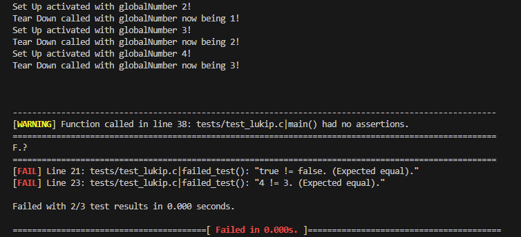
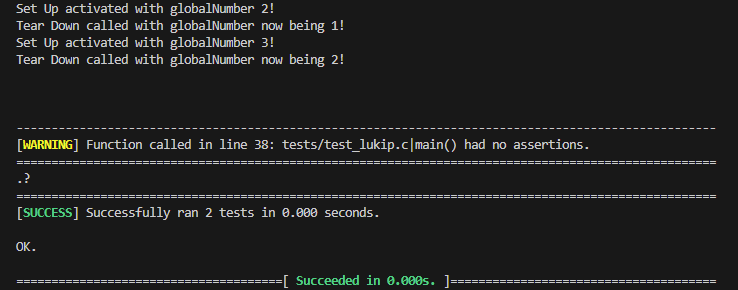

# Lukip
A small unit-testing framework/library made in C by me.

## What the project's about
It's for testing C applications with simple but convenient functions by just compiling an archive (.a) file with your other *.o test files. It also works on Linux and Windows (at least as far as my testing on my Windows 10 and Ubuntu WSL goes).

## Building
Clone in the directory you want it on with:
 ``` sh
git clone https://github.com/Larmix0/lukip.git
```

Then you can compile and use the static .a file produced with `cd lukip` and `make`. <br/>
The archive will appear at the same folder of the Makefile.

### Testing (for development)
Inside the lukip directory, compile the project with the tests using:
```sh
make tests
```

then run the tests with this if you're on Linux (Although I believe this also works for Windows):
```sh
./bin/lukip
```

This also works (and is the typical way to do it) if you're on Windows
```sh
.\bin\lukip.exe
```
### cleaning
use `make clean` to remove all object/binary/archive files generated.

## Usage example
#### This is a simple failed program example:
```sh
#include <stdbool.h>
#include <stdio.h>
#include <stdint.h>

#include "lukip.h"

int globalNumber = 0;

void set_up() {
    globalNumber += 2;
    printf("Set Up activated with globalNumber %d!\n", globalNumber);
}
void tear_down() {
    globalNumber--;
    printf("Tear Down called with globalNumber now being %d!\n", globalNumber);
}

void empty_test() {
    // Give us warning for having no assertions.
}

void failed_test() {
    LUKIP_BOOL_EQUAL(true, false); // Fail.
    LUKIP_INT_EQUAL(7, 7);
    LUKIP_INT_EQUAL(4, 3); // Fail.
}

void successful_test() {
    int8_t five = 5; // Showcases that it handles multiple types.
    LUKIP_INT_EQUAL(five, 5);
    LUKIP_INT_EQUAL(2, 2);
    LUKIP_BOOL_EQUAL(true, true);
}

int main() {
    LUKIP_INIT();
    MAKE_TEST_SUITE(set_up, tear_down);

    TEST(failed_test); // Fails because of this call here.
    TEST(successful_test);
    TEST(empty_test);

    LUKIP_END();
    return 0;
}
```
#### The output of the failed program looks like the following:


#### If we remove/comment the third line of main `TEST(failed_test);` then the successful output looks like the following:


## Why I made Lukip
For fun as well as having a small, easy-to-use unit-testing framework in C, instead of having to install other ones. Especially because I'm personally about to start making a programming language, which will have testing.

It was also a nice learning experience.

## Known issues
* Missing documentation. I will add it later.
* Needs more assertions (will be added very soon).
* Better and more tests.
