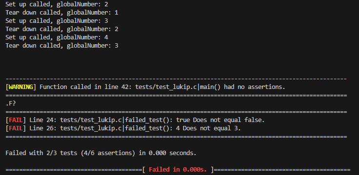

# Lukip
A small unit-testing framework I made in C.

## What the project's about
It's for testing C applications conveniently by just compiling an archive (.a) file with your other test files.
It also works on Linux and Windows (at least as far as my testing on my Windows 10 and Ubuntu WSL goes).

## Building
Clone in the directory you want it on with:
 ``` sh
git clone https://github.com/Larmix0/lukip.git
```

Then you can compile and use the static .a file produced with `cd lukip` and `make`. <br/>
The archive will appear at the same folder of the Makefile.

### Testing (for development)
Inside the lukip directory, compile the project with the tests using:
```sh
make tests
```

then run the tests with this if you're on Linux (Although I believe this also works for Windows):
```sh
./bin/lukip
```

This also works (and is the typical way to do it) if you're on Windows
```sh
.\bin\lukip.exe
```
### cleaning
use `make clean` to remove all object/binary/archive files generated.

## Usage example
#### This is a simple failed program example:
```sh
#include <stdbool.h>
#include <stdio.h>
#include <stdint.h>

#include "lukip.h"

int globalNumber = 0;

TEST_FIXTURE(setup_example) {
    globalNumber += 2;
    printf("Set up called, globalNumber: %d\n", globalNumber);
}

TEST_FIXTURE(teardown_example) {
    globalNumber--;
    printf("Tear down called, globalNumber: %d\n", globalNumber);
}

TEST_CASE(empty_test) {
    // Gives us a warning for having no assertions.
}

TEST_CASE(failed_test) {
    ASSERT_BOOL_EQUAL(true, false); // Fail.
    ASSERT_INT_EQUAL(7, 7);
    ASSERT_INT_EQUAL(4, 3); // Fail.
}

TEST_CASE(successful_test) {
    int8_t five = 5;
    ASSERT_INT_EQUAL(five, 5);
    ASSERT_INT_EQUAL(2, 2);
    ASSERT_BOOL_EQUAL(true, true);
}

int main() {
    LUKIP_INIT();
    MAKE_TEST_FIXTURE(setup_example, teardown_example);

    TEST(successful_test);
    TEST(failed_test); // Fails because of this.
    TEST(empty_test);
    return 0;
}
```
#### The output of the failed program looks like the following:


#### If we remove/comment the third line of main `TEST(failed_test);` then the successful output looks like the following:


## Available assertions and their supported operands
#### Signed numbers (==, !=, >, >=, <, <=)
* int <br>
* int8 <br>
* int32 <br>
* int64 <br>
* long <br>
* float <br>
* double <br>
* hex <br>
* binary <br>

#### Unsigned numbers (==, !=, >, >=, <, <=)
* uint <br>
* uint8 <br>
* uint16 <br>
* uint32 <br>
* uint64 <br>
* ulong <br>
* uhex <br>
* ubinary <br>
* size_t <br>

#### Equal or not (==, !=)
* float within precision <br>
* char <br>
* bool <br>
* address <br>
* byte array <br>
* string <br>
* is NULL <br>

#### Raise (automatically outputs a result)
* Failure <br>
* Failure with a custom formatted message <br>
* Warning <br>
* Warning with a custom formatted message <br>

#### Special
* is true <br>
* is false <br>
* is condition (another name for is true) <br>
* is custom (same as is true, but with a custom formatted message)

## Why I made Lukip
For fun as well as having a small, easy-to-use unit-testing framework in C,
instead of having to install other ones. Also because
I'm personally about to start making a programming language,
which I want to rely exclusively on my own code, including the testing framework.

(It was also a nice learning experience).

## Contributing
I currently don't accept any contributions as this is a personal project.
However, if you find any bugs then feel free to alert me by submitting an issue.

## Known issues
* Better and more tests for Lukip's source.
